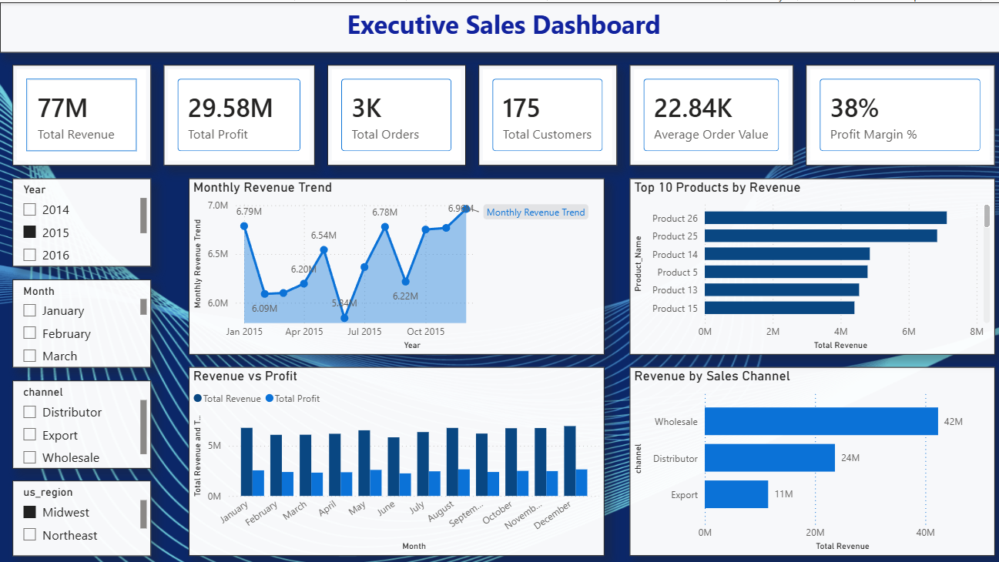
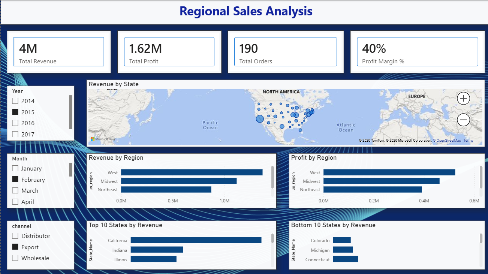
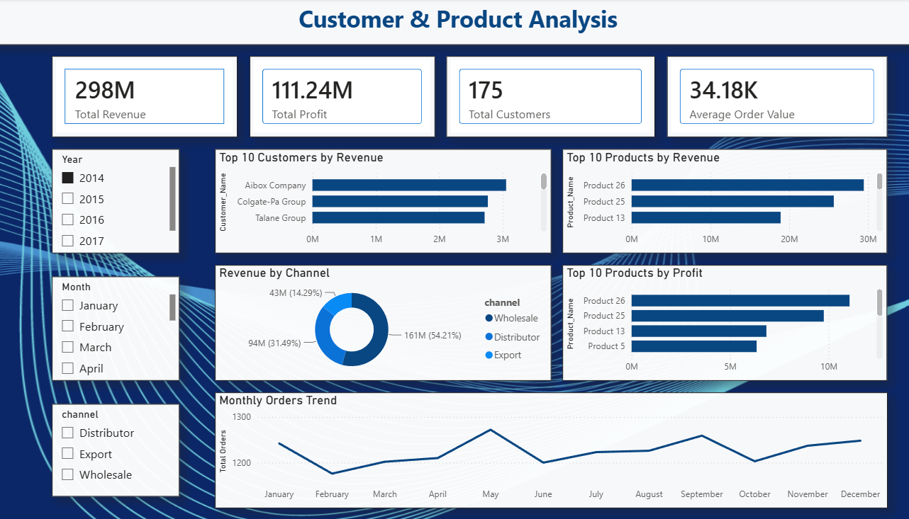
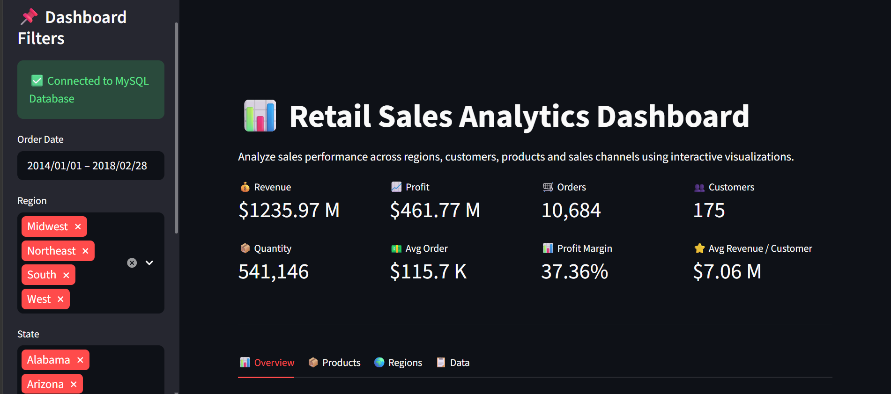

# 📊 Retail Sales Intelligence Dashboard

An end-to-end Data Analytics project that transforms raw retail sales data into actionable business insights using **Python, MySQL, Power BI, and Streamlit**.

The project demonstrates the complete analytics workflow, including data cleaning, exploratory data analysis (EDA), SQL-based business analysis, interactive dashboards, and web application development.

---

# 🚀 Project Overview

This project analyzes retail sales data to identify sales trends, customer behavior, regional performance, and product profitability through interactive visualizations and dashboards.

The project covers the complete data analytics lifecycle:

- Data Cleaning
- Exploratory Data Analysis (EDA)
- Feature Engineering
- SQL Business Analysis
- Power BI Dashboard Development
- Interactive Streamlit Web Application
- Cloud Deployment

## ✨ Project Highlights

- Built an end-to-end retail analytics solution using **Python, MySQL, SQL, Power BI, and Streamlit**.
- Performed data cleaning, transformation, feature engineering, and exploratory data analysis using **Python and Pandas**.
- Developed **45+ SQL queries** covering business analysis, aggregations, window functions, ranking functions, running totals, and CTEs.
- Created **three interactive Power BI dashboards** covering executive performance, regional analysis, and customer & product insights.
- Added dynamic filters for **Year, Month, Sales Channel, and Region** to enable focused analysis.
- Analyzed revenue, profit, customers, products, regions, states, sales channels, and monthly order trends.
- Developed and deployed an interactive **Streamlit application** with MySQL connectivity and CSV fallback support.
- Organized the project into separate folders for **data, notebooks, SQL, Power BI, screenshots, and Streamlit** for better project structure and reproducibility.

---

# 🌐 Live Demo

### 🚀 Streamlit App

https://retail-sales-analytics-pzliszurmrwxhiwtpxs6ow.streamlit.app/

### 💻 GitHub Repository

https://github.com/jainvanshika21/Retail-Sales-Analytics

---

# 🛠️ Tech Stack

| Technology | Purpose |
|------------|---------|
| Python | Data Cleaning & Analysis |
| Pandas | Data Manipulation |
| NumPy | Numerical Operations |
| Plotly | Interactive Visualizations |
| Matplotlib | Data Visualization |
| MySQL | Data Storage & SQL Analysis |
| SQLAlchemy | Database Connection |
| Power BI | Interactive Dashboard |
| Streamlit | Interactive Web Application |
| Git & GitHub | Version Control |

---

# 📂 Project Structure

```text
Retail-Sales-Analytics/
│
├── data/
│   ├── retail_sales.csv
│   └── cleaned_sales_data.csv
│
├── notebooks/
│   ├── 01_Data_Cleaning_EDA.ipynb
│   └── 02_SQL_Data_Export.ipynb
│
├── sql/
│   └── sales_analysis.sql
│
├── powerbi/
│   └── Retail_Sales_Dashboard.pbix
│
├── streamlit/
│   └── app.py
│
├── requirements.txt
├── README.md
├── LICENSE
└── .gitignore
```

---

# 📊 Dataset

The dataset contains retail sales transactions with information such as:

- Order Date
- Customer Details
- Product Details
- Sales Channel
- Region & State
- Revenue
- Profit
- Quantity Sold

---

# 🐍 Python Workflow

The Python notebooks perform:

- Data Loading
- Data Cleaning
- Missing Value Handling
- Duplicate Removal
- Data Type Conversion
- Feature Engineering
- Exploratory Data Analysis (EDA)
- Data Visualization
- Export Clean Dataset

### Feature Engineering

Additional features created include:

- Year
- Quarter
- Month
- Weekday
- Week Number

---

# 🗄️ SQL Analysis

The cleaned dataset is exported to MySQL for business analysis.

The SQL script contains **45 analytical SQL queries**, including:

- Revenue Analysis
- Profit Analysis
- Customer Analysis
- Product Analysis
- Regional Analysis
- Monthly Sales Trends
- Window Functions
- Ranking Functions
- Running Totals
- Common Table Expressions (CTEs)

---
## 📈 Power BI Dashboard

The Power BI report contains three interactive dashboards designed to provide insights into overall sales performance, regional performance, and customer & product analysis.

### Dashboard 1 – Executive Overview

- KPI Cards
- Monthly Revenue Trend
- Monthly Profit Trend
- Sales Overview



### Dashboard 2 – Regional Analysis

- Revenue by Region
- Revenue by State
- Sales Distribution Map



### Dashboard 3 – Customer & Product Analysis

- Top Customers
- Top Products
- Product Profitability
- Customer Insights



> 💡 All KPIs and visualizations are dynamically updated based on the selected Year, Month, Sales Channel, and Region filters, enabling users to perform focused and interactive analysis.


---

## 🌐 Streamlit Dashboard

The Streamlit application provides an interactive interface for exploring key retail sales insights.

Features include:

- KPI Metrics
- Revenue Analysis
- Profit Analysis
- Monthly Trends
- Region-wise Analysis
- Product Performance
- Customer Analysis
- Interactive Filters
- CSV Download



The application first attempts to connect to a MySQL database using environment variables. If a database connection is unavailable, such as during cloud deployment, it automatically loads the cleaned CSV dataset as a fallback.
---

# ☁️ Deployment

The application is deployed on **Streamlit Community Cloud**.

It automatically:

- Connects to the MySQL database when valid environment variables are available.
- Falls back to the cleaned CSV dataset if the database is unavailable.

This allows the dashboard to work seamlessly in both local and cloud environments.

---

## 📌 Key Insights

- Built interactive dashboards with dynamic slicers for **Year, Month, Sales Channel, and Region**, allowing users to drill down into specific business segments.
- Analyzed sales performance across **regions and states** to identify geographic differences in revenue and profitability.
- Compared **revenue and profit by region** to evaluate regional business performance.
- Identified and ranked **top-performing and lower-performing states** based on revenue.
- Analyzed **customer and product performance** using revenue and profit rankings.
- Compared revenue contribution across **Wholesale, Distributor, and Export** sales channels.
- Evaluated monthly order trends to understand changes in customer purchasing activity over time.
- Used **SQL, Power BI, and Streamlit** to create an end-to-end analytics solution that supports interactive business analysis and data-driven decision-making.

---

# 💻 Installation

### Clone the repository

```bash
git clone https://github.com/jainvanshika21/Retail-Sales-Analytics.git
```

### Navigate to the project directory

```bash
cd Retail-Sales-Analytics
```

### Install dependencies

```bash
pip install -r requirements.txt
```

### Run the Streamlit application

```bash
streamlit run streamlit/app.py
```

---

# 🎯 Skills Demonstrated

- Data Cleaning
- Exploratory Data Analysis (EDA)
- Feature Engineering
- SQL Query Writing
- Window Functions
- Common Table Expressions (CTEs)
- Power BI Dashboard Development
- Streamlit Application Development
- Data Visualization
- Dashboard Design
- Data Storytelling
- Git & GitHub

---

## 📬 Contact

**Vanshika Jain**  
MCA Student | Aspiring Data Analyst

- 🔗 [GitHub](https://github.com/jainvanshika21)
- 🔗 [LinkedIn](https://www.linkedin.com/in/vanshika-jain-17007128a/)

⭐ If you found this project helpful, consider giving it a star!
